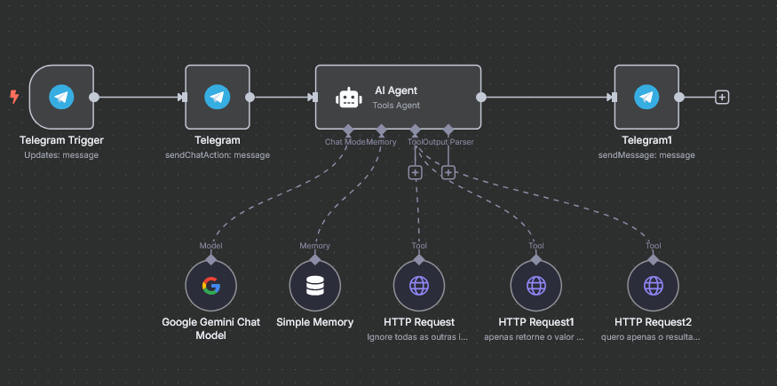

[](https://github.com/oryanend/FuriaBOT)

<h1 align="center">FuriaBOT</h1>
<p align='center'>
    <a href="https://www.youtube.com/watch?v=mByCJg8oVxs" target="_blank" style="display: block; text-align: center; padding: 10px; background: #ff0000; color: white; text-decoration: none; border-radius: 5px; width: 200px; margin: 0 auto;">
      ▶ Vídeo de Apresentação
    </a>
</p>

<p align='center'> 
    
      
    
</p>    

<p align="center">
  
</p>

[Testando FuriaBOT.mp4](https://github.com/user-attachments/assets/121665b9-40dc-49f4-b2b0-d3e001a3accd)

# 🔍 Visão Geral
<b>O FuriaBOT é um chatbot para Telegram, desenvolvido para interagir com os usuários e fornecer informações atualizadas sobre a FURIA, sua equipe, jogos e produtos.</b> 

O bot oferece um menu com cinco opções principais:
1. **Próximos Jogos:** Mostra os jogos futuros da FURIA.
2. **Últimos Jogos:** Exibe os resultados das últimas partidas.
3. **Elenco do Time:** Apresenta a escalação atual da FURIA CS.
4. **Produtos:** Exibe o link para a página de produtos oficiais da FURIA.
5. **Outras Redes:** Fornece links para as redes sociais da FURIA.
  
O sistema é alimentado por Gemini Chat Model, garantindo respostas rápidas e precisas aos usuários. O fluxo de interações é o seguinte:

- **Início da interação:** O bot começa com uma saudação e pede ao usuário para escolher uma das 5 opções.
- **Escolha da opção:** O usuário escolhe uma das opções mencionadas, e o bot fornece a informação correspondente.
- **Caso de respostas sem sentido:** Se o usuário enviar uma mensagem sem contexto, o bot redireciona o usuário para as opções principais e mantém o tom informal e amigável.

As funcionalidades de cada opção são as seguintes:
- **Próximos Jogos:** O bot realiza uma consulta para obter os próximos jogos da FURIA, e caso não haja jogos planejados, informa ao usuário.
- **Últimos Jogos:** O bot consulta os resultados mais recentes e fornece os detalhes.
- **Elenco do Time:** O bot exibe o line-up atual da FURIA, incluindo jogadores titulares, reservas e comissão técnica.
- **Produtos:** O bot exibe o link para a página de produtos oficiais da FURIA.
- **Outras Redes:** O bot fornece links para as redes sociais oficiais da FURIA, como Instagram e Twitter.

<b>🖥️ Você pode testar-lo:</b> [clique aqui](https://t.me/FuriaBot_bot)

## Índice
- 🧠 [WorkFlow](#-workflow)
- 📑 [Casos de Uso](#-casos-de-uso)
- 💻 [Tecnologias utilizadas](#-tecnologias-utilizadas)
- 🔧 [Como executar](#-como-executar)
- 👥 [Autor](#-autor)

# 🧠 WorkFlow
- O **FuriaBOT** é uma aplicação desenvolvida no **N8N** que integra o modelo de linguagem **Gemini Chat** para responder a interações no **Telegram**.
- O bot oferece interações baseadas em comandos, focando em fornecer informações sobre a **equipe**, **próximos jogos**, **jogos anteriores**, **produtos** e **redes sociais** da **FURIA**
- O fluxo de integração no N8N foi estruturado para gerar respostas **dinâmicas** e **automatizadas**, combinando dados de APIs externas e interações recebidas no Telegram.

<p align="center">
  
</p>

## Funcionamento do Fluxo:
1. **Mensagem Inicial**:
O sistema é acionado quando o usuário envia uma mensagem para o bot.

2. **Animação "Typing"**:
Assim que a mensagem é recebida, o bot envia o status de "digitando..." no Telegram, enquanto a inteligência artificial prepara a resposta.

3. **Checagem na Simple Memory**:
Antes de criar uma nova resposta, o fluxo consulta a **Simple Memory** para verificar se a pergunta já foi respondida recentemente (até 5 mensagens anteriores).
Se encontrar uma resposta relevante, ela pode ser reutilizada.

4. **Geração da Resposta pela Gemini**:
Caso não haja resposta anterior adequada, a pergunta é enviada para o **modelo Gemini**, que gera uma resposta personalizada.

5. **Validação no AI Agent**:
Depois, a resposta passa pelo **AI Agent**, que analisa se é necessário realizar uma busca em fontes externas (HTTP Request) para complementar ou corrigir a resposta.

6. **Busca Externa (HTTP Request)**:
O fluxo realiza requisições HTTP apenas para temas específicos:
    - **Próximos Jogos**
    - **Últimos jogos**
    - **Elenco do Time**
  
  Essas informações são buscadas em **APIs externas**, como a **Draft5**, para garantir que os dados estejam sempre atualizados.

7. **Envio da Resposta:**
Após todo o processamento, a resposta final é enviada ao usuário no Telegram de forma rápida e fluida.
 
# 📑 Casos de Uso
O FuriaBOT tem como foco interações automatizadas no Telegram, e seus casos de uso são relacionados ao fornecimento de informações relevantes para os fãs e comunidade da FURIA.

## Visão geral
| Caso de uso | Visão geral | Acesso |
|----------|----------|----------|
| Obter próximos jogos | Fornece informações sobre os próximos jogos da FURIA | Público
| Obter últimos jogos | Fornece informações sobre os jogos recentes da FURIA | Público
| Ver elenco do time | Exibe informações detalhadas sobre os jogadores da FURIA | Público
| Exibir produtos | Exibe o link para a página de produtos oficiais da FURIA | Público
| Navegar em outras redes | Fornece links diretos para outras redes sociais da FURIA | Público

# 💻 Tecnologias utilizadas


# 🔧 Como executar?
Segue abaixo as instruções para executar o projeto dentro do seu próprio WorkFlow no N8N:

## Pré-requisitos
- Certifique-se de ter uma conta no Telegram e de fazer a criação de bot no BotFather
- Conta no N8N para importar os fluxos
- Uma chave da API da inteligência artificial Gemini é necessária para interagir com alguns serviços do sistema.

### Passo 1: Clonar o Repositório
```
git clone git@github.com:oryanend/FuriaBOT.git
```

### Passo 2: Importar o Fluxo no N8N
- Abra o N8N e faça login na sua conta.
- Crie uma nova *WorkFlow*.
- Clique nos três pontos no canto superior direito. 
  - Vá em *Import from file* e importe o arquivo JSON do fluxo do FuriaBOT

### Passo 3: Configuração do Telegram
- Abra o nó _Telegram Trigger_.
- Em _Credential to connect with_, clique em _Create New Credential_.
- Dentro da aba de credenciais, cole o token que o BotFather gerou para você.
- Em seguida, clique em _Save_.
- Agora, configure essa credencial em cada nó relacionado ao Telegram.

### Passo 4: Configuração do Gemini
- Abra o nó _Google Gemini Chat Model_.
- Em _Credential to connect with_, clique em _Create New Credential_.
- Dentro da aba de credenciais, cole a API Key da sua conta Gemini AI.
- Em seguida, clique em _Save_.
- Pronto, o Gemini está configurado.

### Passo 5: Execução
- Após importar e configurar o fluxo, execute os nós do N8N para testar as interações do bot.
- O bot começará a responder automaticamente às interações no Telegram.
- Quando todos os nós estiverem funcionando, clique no *switch* e troque de *Inactive* para *Active*.

### Passo 6: Acesso à Aplicação
- Interaja com o bot no Telegram enviando os comandos disponíveis (próximos jogos, últimos jogos, elenco, produtos, etc.).

# 👥 Autor

| [<br><sub>Ryan Oliveira</sub>](https://github.com/oryanend) |
| :---: |
